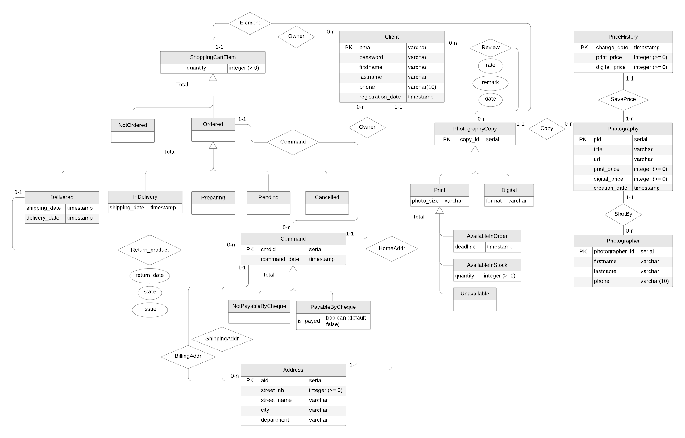
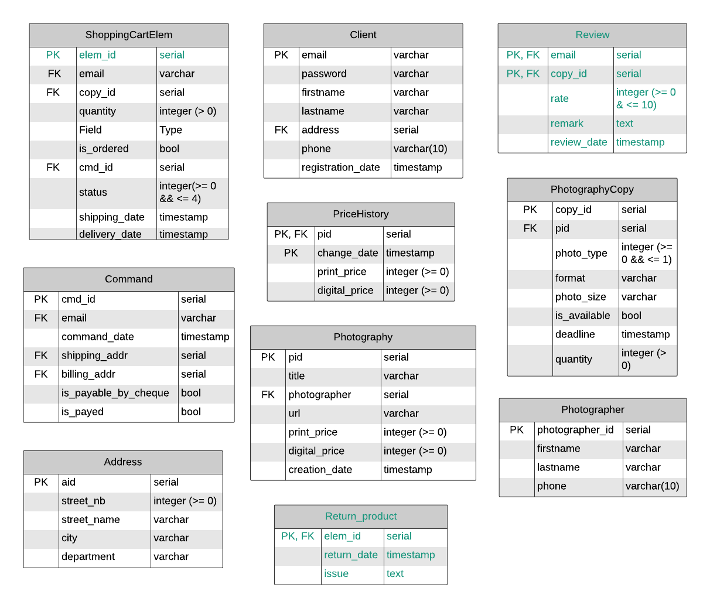

\hfill

## Choix des produits

Nous avons décidé que notre site de e-commerce permettrait à des photographes de vendre
leurs photographies.

Les client$\cdot$e$\cdot$s peuvent acheter les copies de photographie originales.
Elles sont disponibles en deux formats (inclusifs) : numérique ou papier.
Nous avons fait le choix de rendre les **copies numérique** comme étant **toujours disponibles**.
Au **contraire des versions imprimées** qui doivent être disponibles pour pouvoir être commandées.
De plus, **seules les copies imprimées sont retournables**.

\newpage

## Diagramme E/R

La première étape la modélisation consiste à la création d'un diagramme E/R :

Complété des contraintes externes suivantes :

* Un$\cdot$une client$\cdot$e (`Client`) peut émettre un commentaire (`Review`) sur une copie de photographie (`PhotographyCopy`)
uniquement si il$\cdot$elle l'a déjà reçu (`Delivered`).
* Seuls les produits délivrés (`Delivered`) peuvent être retournés (`ReturnProduct`).
* La date d'expédition doit être inférieur à la date de réception : `Delivered.shipping_date` < `Delivered.received_date`.
* Si l'adresse de facturation (`Command.billing_addr`) n'est pas renseignée, l'adresse d'expédition (`Command.shipping_addr`) est utilisée.
* Un élément d'un panier (`ShoppingCartElem`) peut être annulé (`Cancelled`) seulement si il est en attente (`Pending`) ou en préparation (`Preparing`).
* Lorsqu'une copie est ajoutée dans un panier comme élément (`ShoppingCartElem`) : `AvailableInStock.quantity` -= `ShoppingCartElem.quantity`
* Lorsqu'un élément du panier (`ShoppingCartElem`) est annulé (`Cancelled`) : `AvailableInStock.quantity` += `ShoppingCartElem.quantity`
* Toute modification du prix d'une photographie (`Photography`) doit être reportée dans l'historique (`PriceHistory`).
* Seules les copies imprimées (`Print`) sont retournables (`Returnable`).
* Seuls les client$\cdot$e$\cdot$s (`Client`) connecté$\cdot$e$\cdot$s peuvent ajouter une copie (`PhotographyCopy`) dans leur panier (`ShoppingCartElem`).

\newpage

## Traduction en un schéma relationnel

Avant de pouvoir traduire notre diagramme E/R nous devons le restructurer en éliminant
les spécialisations

### Restructuration des spécialisations

La première étape consiste en la restructuration des spécialisations :
`PayableByCheque`, `NotPayableByCheque`, `Delivered`, `InDelivery`,
`Preparing`, `Pending`, `Cancelled`, `Available`, `AvailableInStock`
et `Unavailable`.

*Pour des raisons de lisibilités, les relations sans attributs de cardinalités (`(1-1)` $\rightarrow$ `...`)
 et (`(0-1)` $\rightarrow$ `...`) sont égalements supprimées.*

Les contraintes suivantes sont également ajoutées :

* Si `Print.is_available = true` alors si `Print.quantity > 0` la copie (`PhotographyCopy`) est considérée comme `AvailableInStock`
sinon `Available`. De plus si `Print.is_available = false` alors la copie (`PhotographyCopy`) est considérée comme `Unavailable`.
* Significations des valeurs de `Oredered.status` :
  * 0 $\rightarrow$ `Pending`.
  * 1 $\rightarrow$ `Preparing`.
  * 2 $\rightarrow$ `InDelivery`.
  * 3 $\rightarrow$ `Delivered`.
  * 4 $\rightarrow$ `Cancelled`.

\newpage

La deuxième étape permet la restructuration des spécialisations :
`NotOredered`, `Oredered`, `Print` et `Digital`.

Les contraintes suivantes sont alors ajoutées :

* Significations des valeurs de `PhotographyCopy.photo_type` :
  * 0 $\rightarrow$ `Print`.
  * 1 $\rightarrow$ `Digital`.
* Les valeurs de `ShoppingCartElem.status` possèdent les même significations que pour `Oredered.status`,
avec en plus :
  * $[0,4]$ $\rightarrow$ `Ordered`.
  * -1 $\rightarrow$ `NotOrdered`.

\newpage

### Suppressions des relations

Après la restructuration des spécialisations, nous pouvons supprimer les relations :
`ReturnProduct` et `Review`.

\newpage

### Schéma relationnel

Finalement, nous avons le schéma relationnel suivant :

---

$\texttt{Photographer(\underline{photographer\_id}, firstname, lastname, phone)}$

> *`Photographer[firstname, lastname]` not `NULL`*

$\texttt{Photography(\underline{pid}, title, photographer\_id, url, curr\_price, creation\_date)}$

> *`Photography[photographer_id]` $\subseteq$ `Photographer[photographer_id]`*
>
> *`Photography[title, photographer_id, url, curr_price]` not `NULL`*
>
> *`Photography[curr_price]` $>$ `0`*

$\texttt{PhotographyCopy(\underline{copy\_id}, pid, photo\_type, format, photo\_size, is\_available, deadline, quantity)}$

> *`PhotographyCopy[pid]` $\subseteq$ `Photography[pid]`*
>
> *`PhotographyCopy[pid, photo_type]` not `NULL`*
>
> *`0` $\leq$ `PhotographyCopy[photo_type]` $\leq$ `1`*
>
> *(`PhotographyCopy[photo_type]` $=$ `1`) $\rightarrow$ (`PhotographyCopy[format]` not `NULL`)*
>
> *(`PhotographyCopy[photo_type]` $=$ `0`) $\rightarrow$ (`PhotographyCopy[photo_size]` not `NULL`)*
>
> *`PhotographyCopy[is_available]` $\rightarrow$ (`PhotographyCopy[quantity]` > `0`)*
>
> *$\neg$`PhotographyCopy[is_available]` $\rightarrow$ (`PhotographyCopy[quantity]` $=$ `0`)*
>
> *(`PhotographyCopy[deadline]` not `NULL`) $\rightarrow$ ($\neg$`PhotographyCopy[is_available]`)*

$\texttt{PriceHistory(\underline{pid, change\_date}, price)}$

> *`PriceHistory[pid]` $\subseteq$ `Photography[pid]`*
>
> *(`PriceHistory[price]` $>$ `0`) $\wedge$ (`PriceHistory[price]` not `NULL`)*

$\texttt{Address(\underline{aid}, street\_nb, street\_name, city, departement)}$

> *`Address[street_nb, street_name, city, departement]` not `NULL`*
>
> *`Adress[street_nb]` $\geq$ `0`*

$\texttt{Client(\underline{email}, password, firstname, lastname, address, phone, registration\_date}$

> *`Client[adresse]` $\subseteq$ `Address[aid]`*
>
> *`Client[adresse, password, firstname, lastname, registration_date]` not `NULL`*

$\texttt{Review(\underline{email, copy\_id}, rate, comment, review\_date)}$

> *`Review[email]` $\subseteq$ `Client[email]`*
>
> *`Review[copy_id]` $\subseteq$ `PhotographyCopy[copy_id]`*
>
> *(`0` $\leq$ `Review[rate]` $\leq$ `10`) $\wedge$ (`Review[rate] not `NULL`)*

$\texttt{Command(\underline{cmd\_id}, email , command\_date, shipping\_addr, billing\_addr, is\_payable\_by\_cheque, is\_payed)}$

> *`Command[email]` $\subseteq$ `Client[email]`*
>
> *`Command[shipping_addr]` $\subseteq$ `Address[aid]`*
>
> *`Command[billing_addr]` $\subseteq$ `Address[aid]`*
>
> *`Command[email, command_date, shipping_addr, is_payable_by_cheque, is_payed]` not `NULL`*

$\texttt{ShoppingCartElem(\underline{elem\_id}, email, copy\_id, quantity, cmd\_id, status, shipping\_date, delivery\_date)}$

> *`ShoppingCartElem[email]` $\subseteq$ `Client[email]`*
>
> *`ShoppingCartElem[copy_id]` $\subseteq$ `PhotographyCopy[copy_id]`*
>
> *`ShoppingCartElem[cmd_id]` $\subseteq$ `Command[cmd_id]`*
>
> *`ShoppingCartElem[email, copy_id, quantity, status]` not `NULL`*
>
> *`ShoppingCartElem[shipping_date]` $\leq$ `ShoppingCartElem[delivery_date]`*
>
> *`ShoppingCartElem[quantity]` $>$ `0`*
>
> *`-1` $\leq$ `ShoppingCartElem[status]` $\leq$ `4`*
>
> *(`ShoppingCartElem[status]` $\geq$ `0`) $\rightarrow$ (`ShoppingCartElem[cmd_id]` not `NULL`)*
>
> *(`ShoppingCartElem[status]` $\geq$ `2`) $\rightarrow$ (`ShoppingCartElem[shipping_date, delivery_date]` not `NULL`)*

$\texttt{ReturnProduct(\underline{elem\_id, cmd\_id}, return\_date, issue)}$

> *`ReturnProduct[elem_id]` $\subseteq$ `ShoppingCartElem[elem_id]`*
>
> *`ReturnProduct[cmd_id]` $\subseteq$ `Command[cmd_id]`*

---
