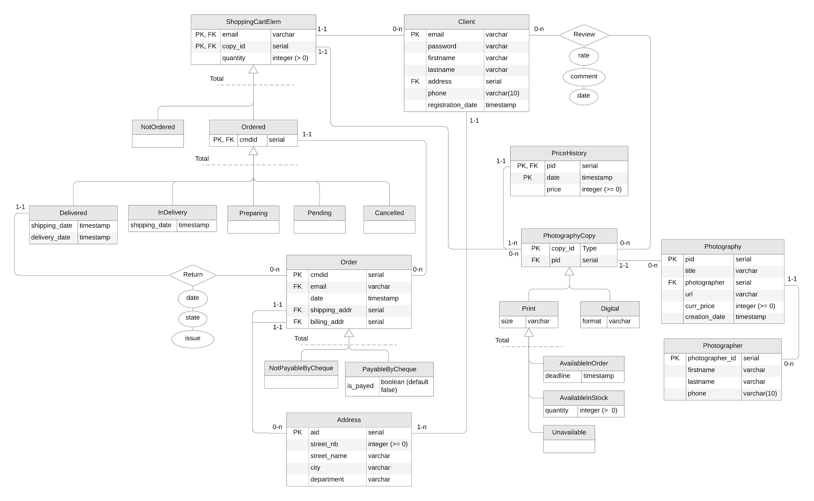

Nous avons décidé que notre site de e-commerce permettrait à des photographes de vendre
leurs photographies.

Les client$\cdot$e$\cdot$s peuvent acheter les copies de photographie originales.
Elles sont disponibles en deux formats (inclusifs) : numérique ou papier.
Nous avons fait le choix de rendre les **copies numérique** comme étant **toujours disponibles**.
Au **contraire des versions imprimées** qui doivent être disponibles pour pouvoir être commandées.
De plus, seules les copies imprimées sont retournables.

## Diagramme ER

La première étape la modélisation consiste à la création d'un diagramme ER:

Complété des contraintes externes suivantes:

* Un$\cdot$une client$\cdot$e (`Client`) peut émettre un commentaire (`Review`) sur une copie de photographie (`PhotographyCopy`)
uniquement si il$\cdot$elle l'a déjà reçu. (**(emile): à discuter**)
* Seuls les produits délivrés (`Delivered`) peuvent être retournés (`Return`).
* La date d'expédition doit être inférieur à la date de réception : `Delivered.shipping_date` < `Delivered.received_date`.
* Si l'adresse de facturation (`Order.billing_addr`) n'est pas renseignée, l'adresse d'expédition (`Order.shipping_addr`) est utilisée.
* Un élément d'un panier (`ShoppingCartElem`) peut être annulé (`Cancelled`) seulement si il est en attente (`Pending`) ou en préparation (`Preparing`).
* Lorsqu'une copie est ajoutée dans un panier comme élément (`ShoppingCartElem`) : `AvailableInStock.quantity` -= `ShoppingCartElem.quantity`
* Lorsqu'un élément du panier (`ShoppingCartElem`) est annulé (`Cancelled`) : `AvailableInStock.quantity` += `ShoppingCartElem.quantity`
* Toute modification du prix d'une photographie (`Photography`) doit être reportée dans l'historique (`PriceHistory`).
* Seules les copies imprimées (`Print`) sont retournables (`Returnable`).
* Seuls les client$\cdot$e$\cdot$s (`Client`) connecté$\cdot$e$\cdot$s peuvent ajouter une copie (`PhotographyCopy`) dans leur panier (`ShoppingCartElem`).

## Passage aux tables
