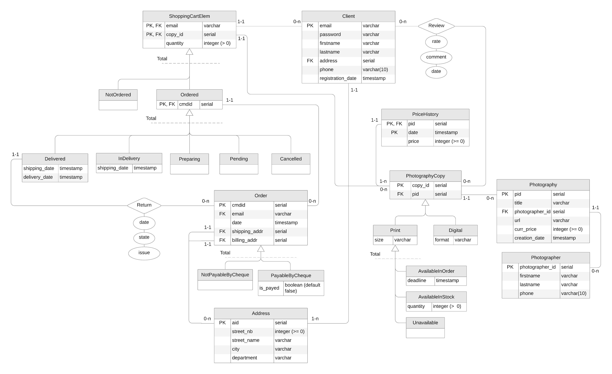
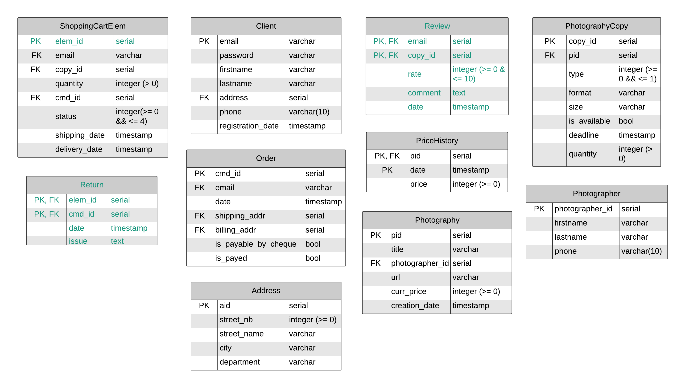

\hfill

## Choix des produits

Nous avons décidé que notre site de e-commerce permettrait à des photographes de vendre
leurs photographies.

Les client$\cdot$e$\cdot$s peuvent acheter les copies de photographie originales.
Elles sont disponibles en deux formats (inclusifs) : numérique ou papier.
Nous avons fait le choix de rendre les **copies numérique** comme étant **toujours disponibles**.
Au **contraire des versions imprimées** qui doivent être disponibles pour pouvoir être commandées.
De plus, **seules les copies imprimées sont retournables**.

\newpage

## Diagramme E/R

La première étape la modélisation consiste à la création d'un diagramme E/R :

*Les relations non nommées sont uniquement là pour montrer les cardinalités des couples (PK, FK), où PK signifie Primary Key et FK signifie Foreign Key.*

Complété des contraintes externes suivantes :

* Un$\cdot$une client$\cdot$e (`Client`) peut émettre un commentaire (`Review`) sur une copie de photographie (`PhotographyCopy`)
uniquement si il$\cdot$elle l'a déjà reçu (`Delivered`).
* Seuls les produits délivrés (`Delivered`) peuvent être retournés (`Return`).
* La date d'expédition doit être inférieur à la date de réception : `Delivered.shipping_date` < `Delivered.received_date`.
* Si l'adresse de facturation (`Order.billing_addr`) n'est pas renseignée, l'adresse d'expédition (`Order.shipping_addr`) est utilisée.
* Un élément d'un panier (`ShoppingCartElem`) peut être annulé (`Cancelled`) seulement si il est en attente (`Pending`) ou en préparation (`Preparing`).
* Lorsqu'une copie est ajoutée dans un panier comme élément (`ShoppingCartElem`) : `AvailableInStock.quantity` -= `ShoppingCartElem.quantity`
* Lorsqu'un élément du panier (`ShoppingCartElem`) est annulé (`Cancelled`) : `AvailableInStock.quantity` += `ShoppingCartElem.quantity`
* Toute modification du prix d'une photographie (`Photography`) doit être reportée dans l'historique (`PriceHistory`).
* Seules les copies imprimées (`Print`) sont retournables (`Returnable`).
* Seuls les client$\cdot$e$\cdot$s (`Client`) connecté$\cdot$e$\cdot$s peuvent ajouter une copie (`PhotographyCopy`) dans leur panier (`ShoppingCartElem`).

\newpage

## Traduction en un schéma relationnel

Avant de pouvoir traduire notre diagramme E/R nous devons le restructurer en éliminant
les spécialisations

### Restructuration des spécialisations

La première étape consiste en la restructuration des spécialisations :
`PayableByCheque`, `NotPayableByCheque`, `Delivered`, `InDelivery`,
`Preparing`, `Pending`, `Cancelled`, `Available`, `AvailableInStock`
et `Unavailable`.

Les contraintes suivantes sont également ajoutées :

* Si `Print.is_available = true` alors si `Print.quantity > 0` la copie (`PhotographyCopy`) est considérée comme `AvailableInStock`
sinon `Available`. De plus si `Print.is_available = false` alors la copie (`PhotographyCopy`) est considérée comme `Unavailable`.
* Significations des valeurs de `Ordered.status` :
  * 0 $\rightarrow$ `Pending`.
  * 1 $\rightarrow$ `Preparing`.
  * 2 $\rightarrow$ `InDelivery`.
  * 3 $\rightarrow$ `Delivered`.
  * 4 $\rightarrow$ `Cancelled`.

\newpage

La deuxième étape permet la restructuration des spécialisations :
`NotOredered`, `Ordered`, `Print` et `Digital`.

Les contraintes suivantes sont alors ajoutées :

* Significations des valeurs de `PhotographyCopy.type` :
  * 0 $\rightarrow$ `Print`.
  * 1 $\rightarrow$ `Digital`.
* Les valeurs de `ShoppingCartElem.status` possèdent les même significations que pour `Oredered.status`,
avec en plus :
  * $[0,4]$ $\rightarrow$ `Ordered`.
  * -1 $\rightarrow$ `NotOrdered`.

\newpage

### Suppressions des relations

Après la restructuration des spécialisations, nous pouvons supprimer les relations :
`Return` et `Review`.

\newpage

### Schéma relationnel

Finalement, nous avons le schéma relationnel suivant :

---

$\texttt{Photographer(\underline{photographer\_id}, firstname, lastname, phone)}$

> *`Photographer[firstname]` not Null*
>
> *`Photographer[lastname]` not Null*

$\texttt{Photography(\underline{pid}, title, photographer\_id, url, curr\_price, creation\_date)}$

> *`Photography[title]` not Null*
>
> *`Photography[photographer_id]` Not Null*
>
> *`Photography[photographer_id]` $\subseteq$ `Photographer[photographer_id]`*
>
> *`Photography[url]` not Null*
>
> *`Photography[curr_price]` > `0` and not Null*

$\texttt{PhotographyCopy(\underline{copy\_id}, pid, type, format, size, is\_available, deadline, quantity)}$

> *`PhotographyCopy[pid]` Not Null*
>
> *`PhotographyCopy[pid]` $\subseteq$ `Photography[pid]`*
>
> *`PhotographyCopy[type]` >= `0` && `PhotographyCopy[type]` <= `1` && not Null*
>
> *`PhotographyCopy[type]` = `1` $\rightarrow$ `PhotographyCopy[format]` not Null*
>
> *`PhotographyCopy[type]` = `0` $\rightarrow$ `PhotographyCopy[size]` not Null*
>
> *`PhotographyCopy[is_available]` = true $\rightarrow$ `PhotographyCopy[quantity]` > 0*
>
> *`PhotographyCopy[is_available]` = false $\rightarrow$ `PhotographyCopy[quantity]` = 0*
>
> *`PhotographyCopy[deadline]` not Null $\rightarrow$ `PhotographyCopy[is_available]` = false*

$\texttt{PriceHistory(\underline{pid, date}, price)}$

> *`PriceHistory[price]` > `0` && not Null*
>
> *`PriceHistory[pid]` $\subseteq$ `Photography[pid]`*

$\texttt{Address(\underline{aid}, street\_nb, street\_name, city, departement)}$

> *`Address[street_nb, street_name, city, departement] not Null*
>
> *`Adress[street_nb]` >= `0`*

$\texttt{Client(\underline{email}, password, firstname, lastname, address, phone, registration\_date}$

> *`Client[adresse, password, firstname, lastname, registration_date]` Not Null*
>
> *`Client[adresse]` $\subseteq$ `Address[aid]`*

$\texttt{Review(\underline{email, copy\_id}, rate, comment, date)}$

> *`Review[rate]` >= `0` && `Review[rate]` <= `10` && `Review[rate] not Null*
>
> *`Review[email]` $\subseteq$ `Client[email]`*
>
> *`Review[copy_id]` $\subseteq$ `PhotographyCopy[copy_id]`*

$\texttt{Order(\underline{cmd\_id}, email , date, shipping\_addr, billing\_addr, is\_payable\_by\_cheque, is\_payed)}$

> *`Order[email, date, shipping_addr, is_payable_by_cheque, is_payed]` Not Null*
>
> *`Order[email]` $\subseteq$ `Client[email]`*
>
> *`Order[shipping_addr]` $\subseteq$ `Address[aid]`*
>
> *`Order[billing_addr]` $\subseteq$ `Address[aid]`*

$\texttt{ShoppingCartElem(\underline{elem\_id}, email, copy\_id, quantity, cmd\_id, status, shipping\_date, delivery\_date)}$

> *`ShoppingCartElem[email, copy_id, quantity, status]` not Null*
>
> *`ShoppingCartElem[shipping_date]` <= `ShoppingCartElem[delivery_date]`*
>
> *`ShoppingCartElem[quantity]` > `0`*
>
> *`ShoppingCartElem[status]` >= `-1` && `ShoppingCartElem[status]` <= `4`*
>
> *`ShoppingCartElem[status]` >= 0 $\rightarrow$ `ShoppingCartElem[cmd_id] not NULL`*
>
> *`ShoppingCartElem[status]` >= 2 $\rightarrow$ `ShoppingCartElem[shipping_date, delivery_date] not NULL`*
>
> *`ShoppingCartElem[email]` $\subseteq$ `Client[email]` && not Null*
>
> *`ShoppingCartElem[copy_id]` $\subseteq$ `PhotographyCopy[copy_id]` && not Null*
>
> *`ShoppingCartElem[cmd_id]` $\subseteq$ `Order[cmd_id]`k*

$\texttt{Return(\underline{elem\_id, cmd\_id}, date, issue)}$

> *`Return[elem_id]` $\subseteq$ `ShoppingCartElem[elem_id]`*
>
> *`Return[cmd_id]` $\subseteq$ `Order[cmd_id]`*

---
